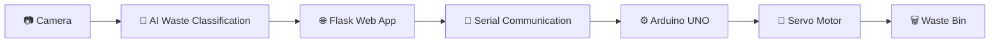
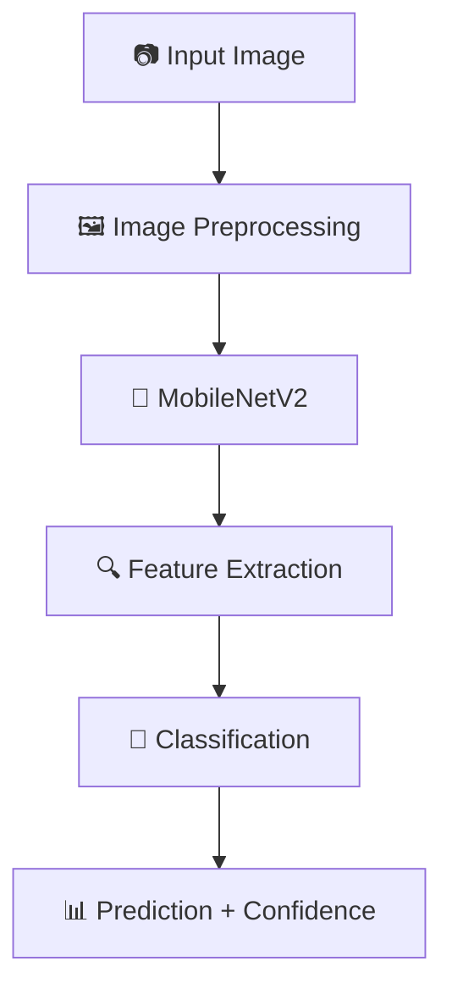
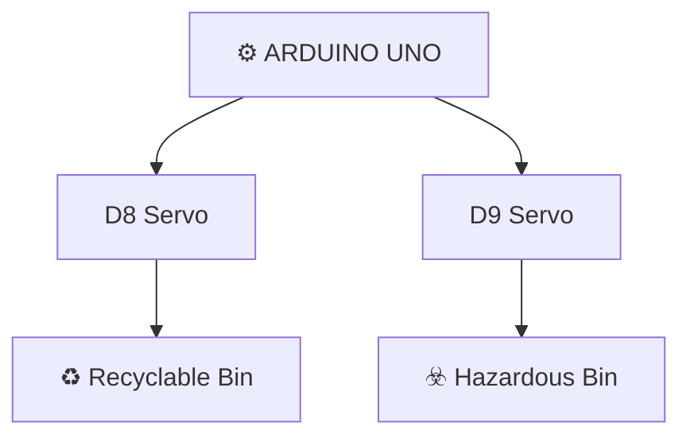
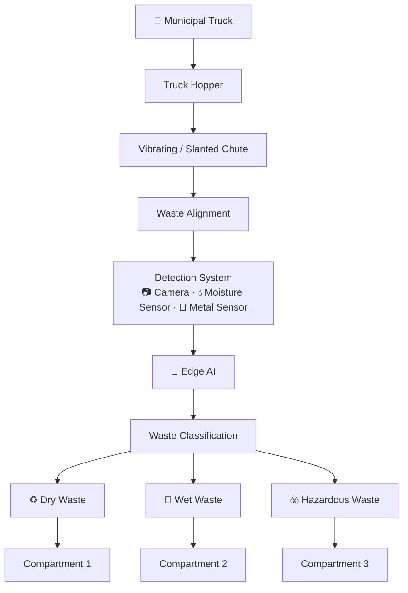
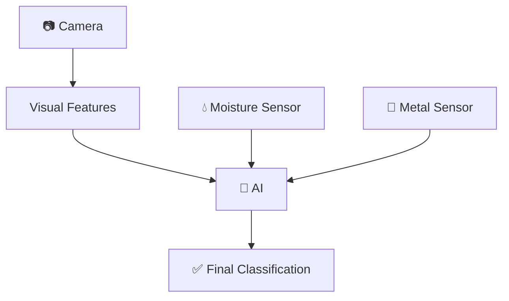
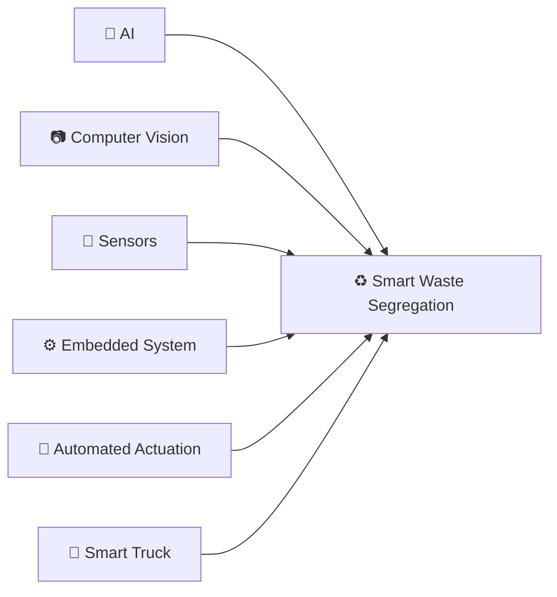
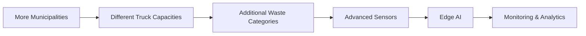
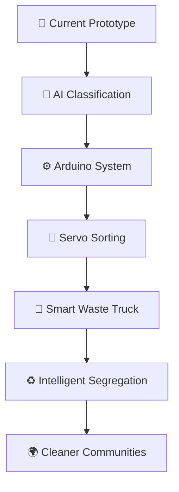

<!-- ===================== HEADER ANIMATION ===================== -->
<p align="center">
  
</p>

<p align="center">
  
</p>

<p align="center">
  <b>AI + Computer Vision + Embedded Systems + Automated Waste Segregation</b>
</p>

<p align="center">
  
  
  
  
  
  
</p>

<p align="center">
  
  
  
</p>

---

## 📑 Table of Contents

- [Overview](#-overview)
- [Problem Statement](#-problem-statement)
- [Proposed Approach](#-proposed-approach)
- [Key Features](#-key-features)
- [Waste Categories](#%EF%B8%8F-waste-categories)
- [AI Model](#-ai-model)
- [Prototype Working](#%EF%B8%8F-prototype-working)
- [Arduino Servo Mapping](#-arduino-servo-mapping)
- [Proposed Municipal Truck System](#-proposed-municipal-garbage-truck-system)
- [Sensor Fusion](#-sensor-fusion)
- [Technology Stack](#%EF%B8%8F-technology-stack)
- [Prototype vs Proposed System](#-prototype-vs-proposed-system)
- [Viability & Impact](#-market-viability)
- [Installation](#-installation)
- [Run the Project](#%EF%B8%8F-run-the-project)
- [Troubleshooting](#%EF%B8%8F-com-port-troubleshooting)
- [Project Structure](#-project-structure)
- [Project Status](#-project-status)
- [Contributors](#-contributors)
- [License](#-license)

---

## 🌍 Overview

The **AI-Powered Smart Waste Segregation System** is an intelligent waste-management solution that combines **Artificial Intelligence, Computer Vision, Flask, Arduino UNO, and servo-controlled hardware** to identify and physically segregate waste.

The current prototype demonstrates the complete workflow:



The proposed real-world version extends the prototype into a **smart municipal garbage collection vehicle**, where waste can be identified and segregated during the collection process.

---

## 🎯 Problem Statement

Mixed household waste is commonly collected together, creating challenges during later sorting and processing.

Manual sorting can:

- Increase sorting effort
- Expose workers to mixed waste
- Make recyclable recovery more difficult
- Increase the complexity of waste processing
- Reduce the efficiency of waste management

---

## 💡 Proposed Approach

The system aims to move intelligent waste segregation **closer to the collection stage**.

Instead of depending only on sorting after mixed waste reaches a processing facility, the proposed system identifies and diverts waste into separate compartments.

---

## 🚀 Key Features

| Feature | Description |
|---|---|
| 🧠 **AI Classification** | Identifies waste categories using an AI model |
| 📷 **Computer Vision** | Uses camera-based waste recognition |
| 🌐 **Flask Interface** | Provides a web interface for prediction |
| ⚙️ **Arduino Control** | Controls the physical sorting mechanism |
| 🔄 **Servo Sorting** | Automatically operates the sorting mechanism |
| 🔌 **Serial Communication** | Python communicates with Arduino |
| ♻️ **Waste Segregation** | Supports physical waste sorting |
| 🌱 **Expandable Architecture** | Supports future sensors and categories |
| 🚛 **Municipal Integration** | Designed for future garbage-truck deployment |

---

## 🗂️ Waste Categories

The current AI prototype identifies three categories:

| Category | Icon | Hardware Output |
|---|---|---|
| **Recyclable** | ♻️ | Arduino **D8** → Servo Motor 1 → Recyclable Bin |
| **Hazardous** | ☣️ | Arduino **D9** → Servo Motor 2 → Hazardous Bin |
| **Biodegradable** | 🌱 | AI prediction only (no servo in current prototype) |

---

## 🧠 AI Model

The current prototype uses **MobileNetV2 + Transfer Learning**, trained for three waste classes:

`biodegradable` · `hazardous` · `recyclable`



The model receives an image from the camera and predicts the corresponding waste category with a confidence value.

---

## ⚙️ Prototype Working

| Step | Stage | Description |
|:---:|---|---|
| 1 | 🗑️ **Waste Input** | A waste item is placed in front of the camera |
| 2 | 📷 **Image Capture** | The camera captures the waste image |
| 3 | 🧠 **AI Prediction** | MobileNetV2 predicts Recyclable, Biodegradable or Hazardous |
| 4 | 🌐 **Flask Processing** | The web app displays the predicted category and confidence |
| 5 | 🔌 **Serial Communication** | Python sends the matching command (`recyclable` / `hazardous`) to Arduino |
| 6 | ⚙️ **Arduino Control** | Arduino receives the command and activates the corresponding servo |
| 7 | 🔄 **Physical Sorting** | The servo directs the waste toward the correct bin |

---

## 🔌 Arduino Servo Mapping



**Serial Commands**

```text
recyclable
hazardous
biodegradable
```

---

## 🚛 Proposed Municipal Garbage Truck System

The prototype is designed as a foundation for a larger automated system that can be integrated into municipal garbage collection vehicles.



---

## 🔬 Sensor Fusion

The proposed production system can combine AI vision with physical sensors.



---

## 🛠️ Technology Stack

### Software


`MobileNetV2` · `PIL` · `PySerial`

### Hardware

- Arduino UNO
- Camera / Webcam
- Servo Motors
- Waste Bins
- Connecting Wires

### Proposed Production Hardware

- Raspberry Pi / Edge AI Device
- Industrial Camera
- Moisture Sensor
- Metal Detection Sensor
- Industrial Actuators
- Truck-integrated Waste Compartments

---

## 📊 Prototype vs Proposed System

| Prototype | Proposed System |
|---|---|
| 📷 Webcam | Industrial Camera |
| 🧠 MobileNetV2 | Lightweight Edge AI / Detection Model |
| 💻 Computer | Edge AI Device |
| ⚙️ Arduino UNO | Embedded Controller |
| 🔄 Servo Motors | Industrial Actuators |
| 🗑️ Small Bins | Truck-integrated Compartments |
| 👤 Manual Waste Placement | Automated Waste Feeding |
| 3 Waste Classes | Expandable Waste Categories |

---

## 💡 Innovation



> **Core Innovation:** AI-based waste identification combined with automated physical waste segregation closer to the collection stage.

---

## 📈 Market Viability

Growing demand for smart waste management and cleaner cities creates opportunities for technology-enabled waste handling.

The proposed system can be adapted for:

- Municipal waste collection
- Private waste management
- Institutional waste management
- Recycling operations
- Waste-processing facilities

## 👥 Customer Viability

- 🏛️ Municipalities
- 🚛 Private Waste Management Companies
- 🏫 Large Institutions
- ♻️ Recycling Organizations
- 🏭 Waste Processing Facilities

## 💰 Financial Viability

Potential revenue models:

**Vehicle Deployment** + **System Installation** + **Maintenance** + **Software Services** + **Data / Analytics Services**

The system is intended to reduce manual sorting effort and support more efficient recyclable material recovery.

## 🔮 Long-Term Viability



## 🌱 Social & Environmental Impact

- 👷 Safer waste handling
- ♻️ Improved recyclable material recovery
- 🗑️ Better waste segregation
- 🌍 Cleaner communities
- ⚙️ Reduced manual sorting effort
- 🚛 More efficient municipal waste management

---

## 🧪 Prototype Testing

The prototype can be tested using representative waste items from the supported categories.


**Example Output**

```text
♻ Recyclable bin opened
Predicted: recyclable
Confidence: 94.5%

☣ Hazardous bin opened
Predicted: hazardous
Confidence: 96.04%
```

---

## 💻 Installation

**1. Clone the repository**

```bash
git clone <YOUR_GITHUB_REPOSITORY_URL>
cd <PROJECT_FOLDER>
```

**2. Create a virtual environment**

```bash
python -m venv venv
```

Activate it (Windows):

```bash
venv\Scripts\activate
```

**3. Install dependencies**

```bash
pip install -r requirements.txt
```

**4. Connect Arduino**

Connect the Arduino UNO via USB and check the COM port:

`Arduino IDE → Tools → Port`

Current prototype configuration: **`COM9`**

**5. Upload the Arduino code**

Open the Arduino sketch (`arduino/waste_sorting.ino`) and upload it to the Arduino UNO.

> ⚠️ Close **Serial Monitor** and **Serial Plotter** before starting Flask. The same COM port cannot be used by the Arduino IDE and Python at the same time.

---

## ▶️ Run the Project

```bash
cd D:\waste_project
venv\Scripts\activate
cd web_app
python app.py
```

Open in your browser:

```text
http://127.0.0.1:5000
```

---

## ⚠️ COM Port Troubleshooting

If you see:

```text
PermissionError(13, 'Access is denied.')
```

the COM port is probably being used by another application. Close:

- ❌ Arduino Serial Monitor
- ❌ Arduino Serial Plotter
- ❌ Another Flask process
- ❌ Another Python process
- ❌ Any other application using COM9

Then restart:

```bash
python app.py
```

---

## 📁 Project Structure

```text
AI-Smart-Waste-Segregation/
│
├── web_app/
│   ├── app.py
│   ├── templates/
│   │   └── index.html
│   ├── static/
│   │   ├── css/
│   │   ├── js/
│   │   └── images/
│   └── ...
│
├── models/
│   └── waste_model_transfer_finetuned2.h5
│
├── arduino/
│   └── waste_sorting.ino
│
├── dataset/
│   ├── recyclable/
│   ├── biodegradable/
│   └── hazardous/
│
├── requirements.txt
└── README.md
```

---

## 📌 Project Status

### ✅ Completed

- [x] AI waste classification
- [x] MobileNetV2 transfer learning
- [x] Camera-based prediction
- [x] Flask web interface
- [x] Arduino communication
- [x] Recyclable servo control
- [x] Hazardous servo control
- [x] Three waste categories
- [x] Prototype hardware integration

### 🚧 Future Development

- [ ] Moisture sensor integration
- [ ] Metal sensor integration
- [ ] Edge AI deployment
- [ ] Automated waste feeding
- [ ] Waste alignment mechanism
- [ ] Industrial actuator integration
- [ ] Municipal truck integration
- [ ] Additional waste categories
- [ ] Monitoring dashboard
- [ ] Waste analytics
- [ ] Real-world dataset expansion

---

## 🗺️ Development Roadmap



> From AI-based waste recognition to intelligent waste segregation inside municipal collection vehicles.

---

## 🏆 Project Highlights

🧠 AI-Based Classification &nbsp;•&nbsp; 📷 Computer Vision &nbsp;•&nbsp; ⚙️ Embedded Hardware &nbsp;•&nbsp; 🔌 Serial Communication  
🔄 Automated Servo Control &nbsp;•&nbsp; ♻️ Waste Segregation &nbsp;•&nbsp; 🚛 Municipal Integration Concept &nbsp;•&nbsp; 🌱 Clean & Green Technology

---

## 👨‍💻 Contributors

| Role | Name |
|---|---|
| **Team Name** | _your team name_ |
| **Project Lead** | _name_ |
| **AI / ML** | _name_ |
| **Hardware** | _name_ |
| **Software** | _name_ |
| **Documentation** | _name_ |
| **Design** | _name_ |

---

## 📜 License

This project is intended for:

- Educational purposes
- Prototype development
- Research
- Innovation
- Demonstration

---

<p align="center">
  
</p>

<p align="center">
  
</p>
